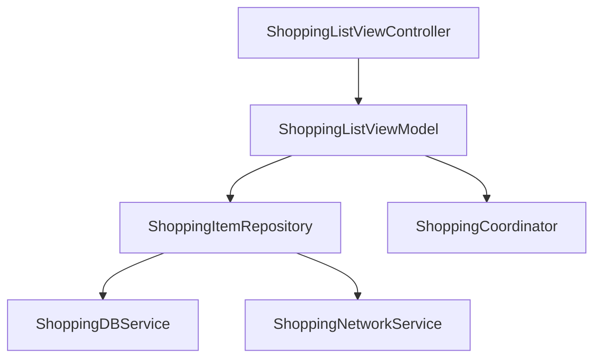

# ShoppingListTask
A modern shopping list application with offline-first capabilities and real-time synchronization.

## Technical Architecture

### High-Level Overview

┌─────────────────┐ ┌─────────────────┐ ┌─────────────────┐
│ UI Layer │ ←→ │ Domain Layer │ ←→ │ Data Layer │
└─────────────────┘ └─────────────────┘ └─────────────────┘
(Views) (ViewModels) (Repositories)

### Architecture Components
- **MVVM-C Pattern**:
  - Model-View-ViewModel with Coordinators
  - Clean separation of concerns
  - Testable components

- **Dependency Injection**:
  - MSDIContainer for managing dependencies
  - Protocol-oriented design for easy mocking

- **Reactive Programming**:
  - Combine framework for state management
  - Data binding between ViewModels and Views

## Key Features

- 📝 Create and manage shopping lists
- ✅ Mark items as bought/unbought
- 🔍 Search and filter items
- 🔄 Automatic sync between devices
- 📱 Offline-first capability

## Technical Stack

### Core Technologies
- **UIKit** for UI components
- **Combine** for reactive programming
- **Core Data** for local persistence
- **Async/Await** (for network service async calls)

### Main Components
| Component | Description |
|-----------|-------------|
| `ShoppingListViewController` | Main list view with items |
| `ShoppingListViewModel` | Business logic for list operations |
| `ShoppingItemRepository` | Mediates between local and remote data |
| `ShoppingCoordinator` | Handles navigation flow |
| `MSDIContainer` | Dependency injection container |

## Getting Started

### Prerequisites
- Xcode 15+
- iOS 17+
- Swift 5.5+

### Installation
1. Clone the repository
   git clone https://github.com/fahadahmedusmani3108/ShoppingListTask.git
2. Open MyShopping.xcodeproj in Xcode
3. Build and run the project
4. You can also use framework in your host application by importing `MyShoppingSDK` module. Call MyShoppingSDK.initialize() to set up the SDK.

### Code Structure
MyShopping/
├── Features/
│   └── ShoppingList/
│       ├── Views/
│       │   ├── ShoppingListViewController.swift
│       │   ├── AddItemViewController.swift
│       │   ├── Shopping.storyboard
│       │   └── ShoppingListCell.swift
│       ├── ViewModels/
│       │   ├── ShoppingListViewModel.swift
│       │   ├── AddItemViewModel.swift
│       │   ├── ShoppingListViewModelAdaptable.swift
│       │   └── AddItemViewModelAdaptable.swift
│       ├── Model/
│       │   └── ShoppingItemModel.swift
│       ├── Coordinator/
│       │   └── ShoppingCoordinator.swift
|       ├── Services/
│       |   ├── Networking
|       |   |   ├── ShoppingNetworkServiceProtocol.swift
|       |   |   └── ShoppingNetworkService.swift
|       |   └── Database
│       |       ├── ShoppingNetworkServiceProtocol.swift
|       │       ├── CoreDataManager.swift
|       │       ├── ShoppingDB.xcdatamodeld
|       │       ├── ShoppingDBServiceProtocol.swift
|       │       └── ShoppingDBService.swift
|       ├── Repository/
│       │   ├── ShoppingItemRepositoryProtocol.swift
│       │   └── ShoppingItemRepository.swift
|       ├── DI/
│       │   ├── ShoppingDIContainer.swift
│       │   ├── ShoppingDIConfigurator.swift
│       ├── Miscellaneous/
│       │   ├── Constants/
│       │   ├── Extensions/
│       │   ├── Helpers/
│       │   ├── Factory/
│       │   └── Enums/
|
└── Core/
    ├── Miscellaneous/
    │   ├── MyShoppingSDK.swift     //initializer
    |   ├── Extensions/
        └── Helpers/
            ├── CoreHelper.swift
            ├── ShoppingBGTaskConfigurator.swift
            └── BackgroundSyncManager.swift

## Dependency Diagram

